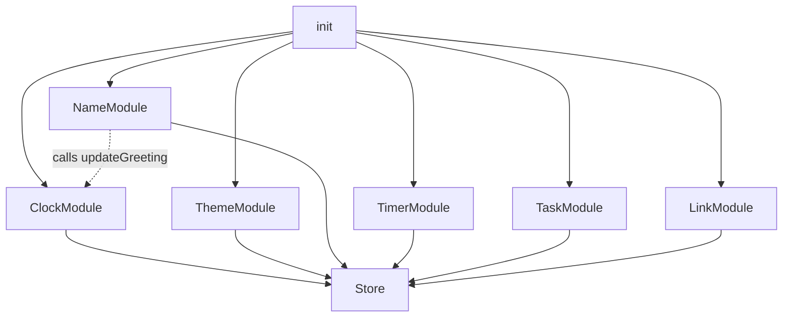

# Design Document — Life Dashboard Rebuild

## Overview

The Life Dashboard is rebuilt as a single-page vanilla JavaScript application with the same three-file structure (`index.html`, `css/style.css`, `js/app.js`) and no build step. The key change from the original is architectural: the single flat script is refactored into a collection of self-contained **module objects** — each feature lives inside its own IIFE or object literal that owns private state and exposes only the minimum public API needed by its collaborators.

The rebuild preserves every existing feature and all localStorage keys so existing user data is not lost. CSS is untouched except for minor documentation improvements.

---

## Architecture

The JavaScript file is organised as a sequence of module definitions followed by a single `init()` call that wires them together. There are no global mutable variables; each module captures its own state in a closure.

```
app.js
├── Store          — localStorage read/write
├── ClockModule    — live clock, date, greeting
├── ThemeModule    — dark/light toggle + persistence
├── NameModule     — editable user name + persistence
├── TimerModule    — countdown timer
├── TaskModule     — to-do list
├── LinkModule     — quick links
└── init()         — bootstraps all modules
```

Dependency flow (one-way, no cycles):



`NameModule` is the only cross-module dependency: after saving a name it calls `ClockModule.updateGreeting()` so the greeting refreshes immediately.

---

## Components and Interfaces

### Store

```js
const Store = (() => {
  function get(key, fallback) { … }
  function set(key, value)    { … }
  return { get, set };
})();
```

All other modules receive `Store` as a parameter to `init` — no global reference required.

### ClockModule

```js
const ClockModule = (() => {
  // private: interval handle, DOM refs
  function start()         { … }   // begins setInterval
  function updateGreeting(name) { … }  // refresh greeting text
  return { start, updateGreeting };
})();
```

`start()` is called once by `init()`. `updateGreeting()` is called by `NameModule` after a name save.

### ThemeModule

```js
const ThemeModule = (() => {
  function init(store) { … }   // reads stored theme, applies, binds toggle
  return { init };
})();
```

### NameModule

```js
const NameModule = (() => {
  function init(store, clockModule) { … }  // renders name, binds edit/save/escape
  return { init };
})();
```

### TimerModule

```js
const TimerModule = (() => {
  // private: intervalHandle, secondsLeft, durationSecs, isRunning
  function init(store) { … }
  return { init };
})();
```

### TaskModule

```js
const TaskModule = (() => {
  // private: tasks[]
  function init(store) { … }
  return { init };
})();
```

Pure helper functions (exported for testing):

| Function | Signature | Purpose |
|---|---|---|
| `sortTasks` | `(tasks, order) → Task[]` | Returns a sorted copy |
| `isDuplicate` | `(tasks, text) → boolean` | Case-insensitive duplicate check |
| `createTask` | `(text) → Task` | Builds a new `{ id, text, done }` object |

### LinkModule

```js
const LinkModule = (() => {
  // private: links[]
  function init(store) { … }
  return { init };
})();
```

Pure helper function:

| Function | Signature | Purpose |
|---|---|---|
| `normaliseUrl` | `(url) → string` | Prepends `https://` if no scheme present |

### Pure Utility Functions (module-level, not inside any module object)

| Function | Signature | Purpose |
|---|---|---|
| `pad` | `(n) → string` | Zero-pads a single digit to two characters |
| `formatClockTime` | `(date) → string` | Returns `"HH:MM:SS"` |
| `formatDate` | `(date) → string` | Returns `"Day, D Month YYYY"` |
| `getGreetingText` | `(hour, name) → string` | Returns the greeting phrase |
| `formatTimerDisplay` | `(seconds) → string` | Returns `"MM:SS"` |
| `clampDuration` | `(raw) → number` | Clamps raw input to [1, 120] |

These functions are **pure** (no side effects, no DOM access) which makes them directly unit-testable.

---

## Data Models

### Task

```js
// { id: string, text: string, done: boolean }
```

- `id`: `Date.now().toString(36) + Math.random().toString(36).slice(2,6)` — unique enough for client-side use.
- `text`: trimmed string, max 120 chars, non-empty.
- `done`: boolean, `false` on creation.

Persisted as `JSON.stringify(tasks[])` under key `ld_tasks`.

### Link

```js
// { id: string, label: string, url: string }
```

- `id`: same generation strategy as Task.
- `label`: trimmed string; falls back to the normalised URL if blank.
- `url`: always has a scheme after normalisation.

Persisted under key `ld_links`.

### Theme

A plain string: `"light"` | `"dark"`. Persisted under key `ld_theme`.

### Name

A plain string (empty string for "not set"). Persisted under key `ld_name`.

### Duration

A plain integer (minutes, 1–120). Persisted under key `ld_timer_min`.

---

## Correctness Properties

*A property is a characteristic or behavior that should hold true across all valid executions of a system — essentially, a formal statement about what the system should do. Properties serve as the bridge between human-readable specifications and machine-verifiable correctness guarantees.*

**Property Reflection:** After completing the prework, the following redundancies were resolved:
- Requirements 3.1–3.4 (greeting branches) and 3.5–3.6 (name in greeting) are consolidated into two complementary properties — one covering hour-to-phrase mapping across the full 24-hour range, one covering name inclusion.
- Requirements 7.1 and 7.10 are distinct (list mutation vs. persistence) and kept separate.
- Requirements 8.1 and 8.2 are combined into a single URL normalisation property covering both the prepend and the preserve cases.
- Requirements 7.11–7.15 (sort orders) are combined into one sort-correctness property covering all four non-default orders.

---

### Property 1: Store round-trip

*For any* JSON-serialisable value `v` and any string key `k`, calling `Store.set(k, v)` followed by `Store.get(k, null)` SHALL return a value deeply equal to `v`.

**Validates: Requirements 1.1, 1.2**

---

### Property 2: Clock time format correctness

*For any* `Date` object `d`, `formatClockTime(d)` SHALL return a string matching the pattern `HH:MM:SS` where `HH` equals `d.getHours()`, `MM` equals `d.getMinutes()`, and `SS` equals `d.getSeconds()`, each zero-padded to two digits.

**Validates: Requirements 2.1**

---

### Property 3: Date format correctness

*For any* `Date` object `d`, `formatDate(d)` SHALL return a string containing the full English day name, the numeric day-of-month, the full English month name, and the four-digit year, all matching the values from `d`.

**Validates: Requirements 2.2**

---

### Property 4: Greeting phrase correctness

*For any* integer hour `h` in [0, 23], `getGreetingText(h, '')` SHALL return a string beginning with exactly one of {"Good morning", "Good afternoon", "Good evening", "Good night"}, and the phrase shall be determined by:
- "Good morning" iff `h ∈ [5, 11]`
- "Good afternoon" iff `h ∈ [12, 16]`
- "Good evening" iff `h ∈ [17, 20]`
- "Good night" iff `h ∈ [0,4] ∪ [21,23]`

**Validates: Requirements 3.1, 3.2, 3.3, 3.4**

---

### Property 5: Greeting name inclusion

*For any* integer hour `h` in [0, 23] and any non-empty string `name`, `getGreetingText(h, name)` SHALL end with `", " + name + "! 👋"`. When `name` is the empty string, the result SHALL end with `"! 👋"` and SHALL NOT contain a comma immediately before the `"!"`.

**Validates: Requirements 3.5, 3.6**

---

### Property 6: Timer display format correctness

*For any* non-negative integer `s`, `formatTimerDisplay(s)` SHALL return a string matching the pattern `MM:SS` where the total value equals `s` seconds, `MM = Math.floor(s/60)` zero-padded to two digits, and `SS = s % 60` zero-padded to two digits.

**Validates: Requirements 6.1**

---

### Property 7: Duration clamping

*For any* numeric input `n`, `clampDuration(n)` SHALL return an integer `c` such that `1 ≤ c ≤ 120`. For inputs already in [1, 120], `c` SHALL equal `Math.round(n)`. For `n < 1`, `c` SHALL equal `1`. For `n > 120`, `c` SHALL equal `120`.

**Validates: Requirements 6.10**

---

### Property 8: Task addition grows list

*For any* task list `tasks` and any non-empty string `text` that is not a case-insensitive duplicate of any existing task, calling the task-creation logic SHALL produce a new list of length `tasks.length + 1` containing a task with the given text and `done: false`.

**Validates: Requirements 7.1**

---

### Property 9: Duplicate detection

*For any* task list `tasks` and any string `text`, `isDuplicate(tasks, text)` SHALL return `true` if and only if `tasks` contains at least one task whose text equals `text` ignoring case. For any task in `tasks`, `isDuplicate(tasks, task.text.toUpperCase())` SHALL be `true`. For any string guaranteed not to appear in `tasks`, the result SHALL be `false`.

**Validates: Requirements 7.2**

---

### Property 10: Toggle done is its own inverse

*For any* task list `tasks` and any task id `id` present in the list, toggling the done state twice SHALL restore the original `done` value (round-trip idempotence).

**Validates: Requirements 7.4**

---

### Property 11: Delete removes exactly one task

*For any* task list `tasks` with at least one task, deleting the task with a given `id` SHALL produce a list of length `tasks.length - 1` that does not contain any task with that `id`.

**Validates: Requirements 7.5**

---

### Property 12: Sort correctness

*For any* task list `tasks` and each non-default sort order (`az`, `za`, `done`, `undone`), `sortTasks(tasks, order)` SHALL:
- Return an array of the same length as `tasks`.
- Contain the same task objects (no additions or removals).
- For `az`: every adjacent pair `(a, b)` shall satisfy `a.text.localeCompare(b.text) ≤ 0`.
- For `za`: every adjacent pair shall satisfy `a.text.localeCompare(b.text) ≥ 0`.
- For `done`: all tasks with `done === false` SHALL precede all tasks with `done === true`.
- For `undone`: all tasks with `done === true` SHALL precede all tasks with `done === false`.
- For `default`: the order SHALL equal the original insertion order.

**Validates: Requirements 7.11, 7.12, 7.13, 7.14, 7.15**

---

### Property 13: URL normalisation

*For any* URL string `u`:
- If `u` does not start with `http://` or `https://` (case-insensitive), `normaliseUrl(u)` SHALL return `"https://" + u`.
- If `u` already starts with `https://` or `http://`, `normaliseUrl(u)` SHALL return `u` unchanged.

**Validates: Requirements 8.1, 8.2**

---

## Error Handling

| Scenario | Module | Response |
|---|---|---|
| `localStorage.getItem` throws | Store | Returns `fallback` silently |
| `localStorage.setItem` throws (quota exceeded, private mode) | Store | Ignores error silently |
| `JSON.parse` fails on stored value | Store | Returns `fallback` |
| User adds empty task | TaskModule | Focuses input, does nothing |
| User adds duplicate task | TaskModule | Shows inline error, auto-dismisses after 3 s |
| User sets timer minutes to NaN / out of range | TimerModule | Clamps to [1, 120] |
| Inline task edit committed as empty string | TaskModule | Discards edit, restores original text |
| Link added with empty URL | LinkModule | Focuses URL input, does nothing |

---

## Testing Strategy

### Approach

Because this is a vanilla JS project with no build tooling, tests use **Vitest** (or **Jest**) imported directly as a dev dependency via npm. Only the pure helper functions listed in the Components section are tested with property-based tests; DOM-dependent behaviour uses example-based tests.

**No property-based testing is used for DOM interactions, CSS layout, or accessibility attributes** — those are verified with example-based tests or manual review.

### Property-Based Testing

Property-based tests use **fast-check** (a well-maintained JS PBT library). Each test runs a minimum of 100 iterations.

Tag format for each test: `// Feature: life-dashboard-rebuild, Property N: <property title>`

Properties to implement as automated tests (mapped to the Correctness Properties section):

| Property | Test file | fast-check arbitraries |
|---|---|---|
| 1 — Store round-trip | `store.test.js` | `fc.jsonValue()`, `fc.string()` |
| 2 — Clock time format | `clock.test.js` | Random Date via `fc.date()` |
| 3 — Date format | `clock.test.js` | Random Date via `fc.date()` |
| 4 — Greeting phrase | `clock.test.js` | `fc.integer({ min: 0, max: 23 })` |
| 5 — Greeting name inclusion | `clock.test.js` | `fc.integer()` × `fc.string({ minLength: 1 })` |
| 6 — Timer display format | `timer.test.js` | `fc.integer({ min: 0, max: 7200 })` |
| 7 — Duration clamping | `timer.test.js` | `fc.integer({ min: -1000, max: 1000 })` |
| 8 — Task addition grows list | `tasks.test.js` | `fc.array(taskArb)` × `fc.string({ minLength: 1 })` |
| 9 — Duplicate detection | `tasks.test.js` | `fc.array(taskArb)` × `fc.string()` |
| 10 — Toggle is own inverse | `tasks.test.js` | `fc.array(taskArb, { minLength: 1 })` |
| 11 — Delete removes one | `tasks.test.js` | `fc.array(taskArb, { minLength: 1 })` |
| 12 — Sort correctness | `tasks.test.js` | `fc.array(taskArb)` × `fc.constantFrom('az','za','done','undone','default')` |
| 13 — URL normalisation | `links.test.js` | `fc.webUrl()`, `fc.string()` |

### Unit / Example Tests

Example-based tests cover:

- **ThemeModule**: applying "light" and "dark"; verifying correct icon rendered; verifying attribute on `<html>`.
- **NameModule**: edit mode opens on click; save persists and hides edit mode; Escape cancels; greeting refreshes after save.
- **TimerModule button states**: Start/Stop/Reset state machine transitions for idle → running → paused → reset → finished states.
- **TaskModule UI**: error message shown on duplicate; error clears on input change; inline edit saves on blur; Escape cancels edit; empty task ignored.
- **LinkModule UI**: chip rendered with correct label; chip opens correct URL; remove button deletes chip; empty-URL submission ignored.
- **Accessibility spot-check**: aria-label present on controls; role="alert" on task error; sr-only label on sort select.

### Test Configuration

```js
// vitest.config.js (if used)
export default {
  test: {
    environment: 'jsdom',
    globals: true,
  },
};
```

Pure functions are extracted into a testable JS module (`js/utils.js`) and imported by both `app.js` and the test files. The module pattern for DOM-heavy code is tested with `jsdom`.
