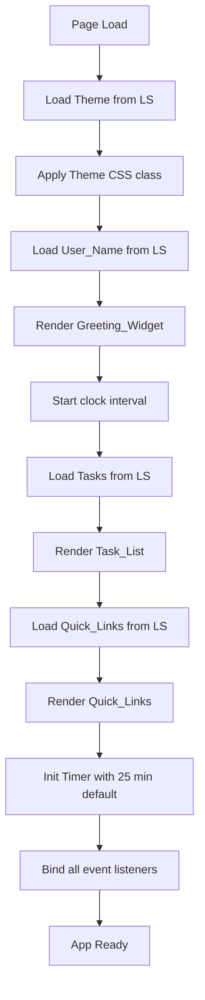

# Design Document: To-Do List Life Dashboard

## Overview

The To-Do List Life Dashboard is a zero-dependency, single-page web application. It combines five widgets — a live greeting clock, a Pomodoro timer, a task manager, a quick-links launcher, and a theme toggle — all persisted through the browser's `localStorage` API. The entire app ships as three files: `index.html`, `css/style.css`, and `js/app.js`.

Because there is no build step, no bundler, and no framework, the architecture is a straightforward module pattern inside a single JavaScript file, organized by widget concern.

---

## Architecture

```
project-root/
├── index.html          ← markup, links CSS and JS
├── css/
│   └── style.css       ← all styles, CSS custom properties for theming
└── js/
    └── app.js          ← all JavaScript, organized by widget module
```

### Execution Flow



### Widget Interaction Pattern

Each widget follows the same read → render → bind → persist cycle:

1. **Read**: Load state from `localStorage` (or use defaults).
2. **Render**: Update the DOM to reflect current state.
3. **Bind**: Attach event listeners to UI controls.
4. **Persist**: On any state change, immediately write back to `localStorage`.

---

## Components and Interfaces

### Module: `GreetingModule`

| Function | Signature | Description |
|---|---|---|
| `getGreeting(hour, name)` | `(number, string) → string` | Returns "Good Morning/Afternoon/Evening, {name}!" based on hour |
| `formatDate(date)` | `(Date) → string` | Returns human-readable date, e.g. "Wednesday, 16 July 2026" |
| `formatTime(date)` | `(Date) → string` | Returns HH:MM:SS string |
| `loadUserName()` | `() → string` | Reads `userName` from LS; defaults to `"User"` |
| `saveUserName(name)` | `(string) → void` | Writes `userName` to LS |
| `initGreeting()` | `() → void` | Mounts widget, starts 1-second interval |

### Module: `TimerModule`

| Function | Signature | Description |
|---|---|---|
| `formatTimerDisplay(totalSeconds)` | `(number) → string` | Converts seconds to "MM:SS" |
| `initTimer()` | `() → void` | Sets up timer state and binds Start/Stop/Reset |
| `startTimer()` | `() → void` | Begins countdown interval |
| `stopTimer()` | `() → void` | Pauses countdown |
| `resetTimer()` | `() → void` | Restores to configured duration |

### Module: `TaskModule`

| Function | Signature | Description |
|---|---|---|
| `loadTasks()` | `() → Task[]` | Reads tasks array from LS; defaults to `[]` |
| `saveTasks(tasks)` | `(Task[]) → void` | Serializes and writes tasks array to LS |
| `addTask(tasks, description)` | `(Task[], string) → Result` | Returns updated array or error if duplicate/empty |
| `deleteTask(tasks, id)` | `(Task[], string) → Task[]` | Returns array minus the task with given id |
| `editTask(tasks, id, newDesc)` | `(Task[], string, string) → Task[]` | Returns updated array with edited description |
| `toggleTask(tasks, id)` | `(Task[], string) → Task[]` | Flips completion status |
| `sortTasks(tasks, criterion)` | `(Task[], SortCriterion) → Task[]` | Returns sorted copy |
| `renderTasks(tasks)` | `(Task[]) → void` | Rebuilds task list DOM |

### Module: `QuickLinksModule`

| Function | Signature | Description |
|---|---|---|
| `loadLinks()` | `() → QuickLink[]` | Reads links from LS; defaults to `[]` |
| `saveLinks(links)` | `(QuickLink[]) → void` | Serializes and writes to LS |
| `addLink(links, label, url)` | `(QuickLink[], string, string) → Result` | Validates and adds, or returns error |
| `deleteLink(links, id)` | `(QuickLink[], string) → QuickLink[]` | Removes by id |
| `isValidUrl(url)` | `(string) → boolean` | Returns true if URL passes `URL` constructor check |
| `renderLinks(links)` | `(QuickLink[]) → void` | Rebuilds links DOM |

### Module: `ThemeModule`

| Function | Signature | Description |
|---|---|---|
| `loadTheme()` | `() → Theme` | Reads `theme` from LS; defaults to `"light"` |
| `saveTheme(theme)` | `(Theme) → void` | Writes `theme` to LS |
| `applyTheme(theme)` | `(Theme) → void` | Adds/removes `dark` class on `<body>` |
| `toggleTheme()` | `() → void` | Flips current theme and persists |

---

## Data Models

### `Task`

```js
{
  id: string,          // crypto.randomUUID() or Date.now().toString()
  description: string, // trimmed, non-empty task text
  completed: boolean,  // false by default
  createdAt: number    // timestamp for stable sorting
}
```

### `QuickLink`

```js
{
  id: string,   // unique identifier
  label: string, // display label
  url: string   // valid absolute URL
}
```

### `SortCriterion`

```js
type SortCriterion = "status" | "alpha"
```

### `Theme`

```js
type Theme = "light" | "dark"
```

### `Result<T>`

```js
{
  ok: boolean,
  data?: T,
  error?: string
}
```

### LocalStorage Keys

| Key | Type | Description |
|---|---|---|
| `userName` | `string` | Display name for greeting |
| `tasks` | `JSON(Task[])` | Serialized task list |
| `quickLinks` | `JSON(QuickLink[])` | Serialized quick links |
| `theme` | `"light" \| "dark"` | Active theme preference |

---

## Correctness Properties

*A property is a characteristic or behavior that should hold true across all valid executions of a system — essentially, a formal statement about what the system should do. Properties serve as the bridge between human-readable specifications and machine-verifiable correctness guarantees.*

The pure-function modules (GreetingModule formatters, TimerModule formatter, TaskModule logic, QuickLinksModule validation, ThemeModule) are well-suited to property-based testing using [fast-check](https://github.com/dubzzz/fast-check). The DOM-side-effect portions (render, bind, browser APIs) are covered by example-based tests.

---

### Property 1: Date formatting produces a non-empty human-readable string

*For any* valid `Date` object, `formatDate(date)` SHALL return a non-empty string.

**Validates: Requirements 1.2**

---

### Property 2: Greeting returns correct period and contains the user name

*For any* integer `hour` in `[0, 23]` and any non-empty string `name`, `getGreeting(hour, name)` SHALL return a string that contains `name` AND contains "Good Morning" when `hour ∈ [5,11]`, "Good Afternoon" when `hour ∈ [12,17]`, or "Good Evening" when `hour ∈ [0,4] ∪ [18,23]`.

**Validates: Requirements 1.3, 1.4, 1.5, 1.6**

---

### Property 3: User name LocalStorage round-trip

*For any* non-empty string `name`, calling `saveUserName(name)` followed by `loadUserName()` SHALL return a value equal to `name`.

**Validates: Requirements 1.7, 1.8**

---

### Property 4: Timer display format

*For any* integer `seconds` in `[0, 5999]` (0 to 99:59), `formatTimerDisplay(seconds)` SHALL return a string matching the regular expression `/^\d{2}:\d{2}$/`.

**Validates: Requirements 2.1**

---

### Property 5: Task addition grows the list

*For any* `Task[]` and any description string that is non-empty after trimming and does not match any existing task description (case-insensitive), calling `addTask(tasks, description)` SHALL return a result where `result.ok === true` and `result.data.length === tasks.length + 1`.

**Validates: Requirements 3.1**

---

### Property 6: Duplicate task rejection

*For any* `Task[]` containing at least one task, attempting to add a description that matches any existing task description (after case-insensitive trimming) SHALL return `result.ok === false`.

**Validates: Requirements 3.2**

---

### Property 7: Whitespace-only task rejection

*For any* string composed entirely of whitespace characters (spaces, tabs, newlines), calling `addTask(tasks, description)` SHALL return `result.ok === false`.

**Validates: Requirements 3.3**

---

### Property 8: Completion toggle is its own inverse (round-trip)

*For any* `Task[]` containing a task with id `id`, calling `toggleTask(toggleTask(tasks, id), id)` SHALL produce a list where the task with `id` has the same `completed` value as in the original list.

**Validates: Requirements 3.4, 3.5**

---

### Property 9: Task edit updates description correctly

*For any* `Task[]` containing a task with id `id`, and any valid non-empty `newDesc`, calling `editTask(tasks, id, newDesc)` SHALL return a list where the task with `id` has `description === newDesc.trim()` and all other fields are unchanged.

**Validates: Requirements 3.6**

---

### Property 10: Task deletion removes exactly one item

*For any* `Task[]` containing a task with id `id`, calling `deleteTask(tasks, id)` SHALL return a list of length `tasks.length - 1` that contains no task with `id`.

**Validates: Requirements 3.7**

---

### Property 11: Task sort by status groups incomplete before complete

*For any* `Task[]`, calling `sortTasks(tasks, "status")` SHALL return a list where all tasks with `completed === false` appear before all tasks with `completed === true`.

**Validates: Requirements 3.8**

---

### Property 12: Task list LocalStorage round-trip

*For any* `Task[]`, calling `saveTasks(tasks)` followed by `loadTasks()` SHALL return a list that is structurally equivalent to the original (same length, same ids, same descriptions, same completion statuses).

**Validates: Requirements 3.9**

---

### Property 13: Quick link addition grows the collection

*For any* `QuickLink[]`, any non-empty `label`, and any valid absolute URL `url`, calling `addLink(links, label, url)` SHALL return `result.ok === true` and `result.data.length === links.length + 1`.

**Validates: Requirements 4.1**

---

### Property 14: Quick link deletion removes exactly one entry

*For any* `QuickLink[]` containing an entry with id `id`, calling `deleteLink(links, id)` SHALL return a list of length `links.length - 1` that contains no entry with `id`.

**Validates: Requirements 4.3**

---

### Property 15: Quick link LocalStorage round-trip

*For any* `QuickLink[]`, calling `saveLinks(links)` followed by `loadLinks()` SHALL return a collection structurally equivalent to the original.

**Validates: Requirements 4.4**

---

### Property 16: Quick link validation rejects empty label or invalid URL

*For any* empty string or whitespace-only string as `label`, OR any string that fails the `URL` constructor check as `url`, calling `addLink(links, label, url)` SHALL return `result.ok === false`.

**Validates: Requirements 4.6**

---

### Property 17: Theme persistence round-trip

*For any* `Theme` value (`"light"` or `"dark"`), calling `saveTheme(theme)` followed by `loadTheme()` SHALL return a value equal to `theme`.

**Validates: Requirements 5.4, 5.5**

---

## Error Handling

| Scenario | Handling |
|---|---|
| `localStorage` unavailable (private mode) | Wrap reads/writes in try/catch; fall back to in-memory state; show a non-blocking warning banner |
| Invalid URL when adding Quick_Link | `isValidUrl()` catches `URL` constructor exceptions; returns `false`; UI shows inline error |
| Empty or duplicate task description | `addTask()` returns `Result` with `ok: false` and descriptive `error` string; UI shows inline error |
| Timer already at 0 when Reset clicked | `resetTimer()` is idempotent — sets to configured duration regardless |
| `JSON.parse` failure on LS data | Wrap in try/catch; return empty default ([] or null); log warning to console |

---

## Testing Strategy

This project has no test-framework setup requirement per NFR-1. The correctness properties above describe the **intended behavior** of pure functions in `app.js`. They are written to be implementable with [fast-check](https://github.com/dubzzz/fast-check) if tests are added later, but no test files are required as part of the MVP build.

**Unit testing approach** (if adopted):
- Pure functions (formatters, validators, data-transform functions) are easily unit-testable in isolation.
- Each function accepts plain JS values and returns plain JS values — no DOM required.
- Property-based tests with fast-check would cover Properties 1–17 above.

**Manual verification checklist** (covers requirements):
- Open `index.html` in Chrome/Firefox/Edge/Safari.
- Verify greeting changes across morning / afternoon / evening hours.
- Add, edit, complete, and delete tasks; reload page to confirm persistence.
- Add duplicate and whitespace tasks; confirm rejection messages.
- Sort tasks by status and alphabetically.
- Add and delete quick links; click to confirm new-tab navigation.
- Toggle theme; reload to confirm persistence.
- Start, stop, and reset timer; set custom duration.
